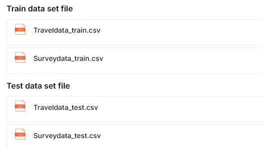
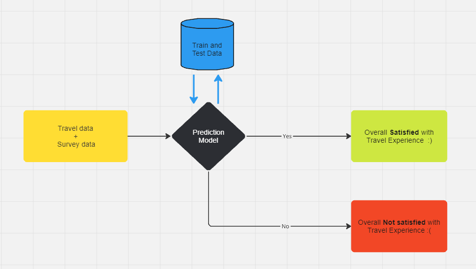

# Shinkansen-traval-hackathon
* The problem focused on improving passenger experience on the Shinkansen Bullet Train in Japan. The goal was to analyze various travel-related parameters and determine which factors had the most influence on passengers' overall satisfaction. Two datasets were provided—travel data and survey data—which contained passenger feedback and travel information.
* The objective was to build a machine learning model to predict whether a passenger was satisfied with their overall travel experience. This required cleaning, validating, and combining the datasets, identifying key parameters influencing satisfaction, and building a predictive model that could accurately classify satisfaction levels.
* Clean and process datasets for building the models. Multiple approaches were explored : NN Model, SVM , Decision Tree, Tuned Decision Tree, Random Forest. Using an iterative process, test different models and hyperparameters trying various approaches to maximize performance. The focus remained on maximizing model performance within the constraints of the evaluation metric.
* The hackathon provided valuable experience in evaluating different approaches and selecting the best performing model under time constraints, resulting in a solution that outperformed baseline models. Highest acccuracy score of 94.3% was achieved

  
## Dataset: 
**Travel data** has information related to passengers and attributes related to the Shinkansen train, in which they traveled. 
**The survey data** is aggregated data of surveys indicating the post-service experience. 
 

 

## Evaluation Criteria:
Accuracy Score: The evaluation metric is the percentage of predictions made by the model that turned out to be accurate best possible accuracy is 100% and the worst possible accuracy is 0%.
It is calculated as the total number of correct predictions (True Positives + True Negatives) divided by the total number of observations in the dataset.

## Models explored: 
1. NN Model 
2. SVN
3. Decision Tree 
4. Random Forest
5. XGBoost
